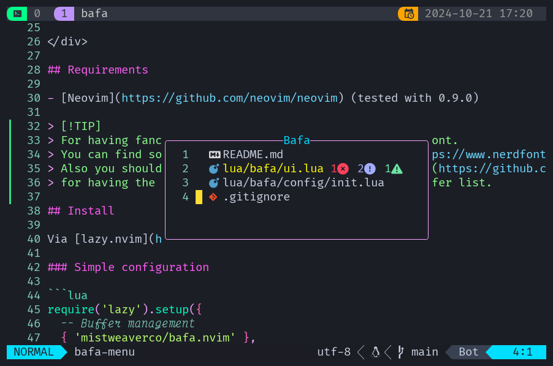

<div align="center">

![Bafa.nvim Logo][logo]

# bafa.nvim

[![Made with love][badge-made-with-love]][contributors]
[![Development status][badge-development-status]][development-status]
[![Our manifesto][badge-our-manifesto]][our-manifesto]
![Made with lua][badge-made-with-lua]
[![Latest release][badge-latest-release]][latest-release]

[What?](#what) •
[Requirements](#requirements) •
[Install](#install) •
[Usage](#usage)

<p></p>

A minimal BufExplorer alternative for lazy people for your favorite editor.

Bafa is swahili for "buffer."

It allows you to quickly switch between buffers and delete them.

<p></p>



<p></p>

</div>

## What?

Bafa.nvim is a Neovim plugin that provides a clear and efficient
way to manage and switch between buffers using a floating window interface.

It uses a notion of "commiting" changes.
This means that any modifications you make in the UI
are only applied to the actual buffer list
when you commit them.

A commit is done when you select a buffer to switch to,
or an empty spot, when no buffers are left.

Commits are discarded when you close the window
without selecting a buffer.

## Requirements

- [Neovim](https://github.com/neovim/neovim) (tested with 0.9.0)

> [!TIP]
> You need to install a patched nerd-font for
> having the icons displayed correctly.
>
> You can find some patched fonts on the
> [Nerd Fonts](https://www.nerdfonts.com/) website.
>
> You should also consider installing
> [nvim-web-devicons](https://github.com/nvim-tree/nvim-web-devicons)
> for having the correct icons based on the filetye in the buffer list.

## Install

Please use release tags when installing the plugin to ensure
compatibility and stability.

The `main` branch may contain breaking changes
and isn't guaranteed to be stable.

### Lazy.nvim

See: [lazy.nvim](https://github.com/folke/lazy.nvim)

```lua
{
  'mistweaverco/bafa.nvim',
  version = 'v1.3.2',
  opts = {}
},
```

> [!IMPORTANT]
> `opts` needs to be at least an empty table `{}` and
> can't be completely omitted.

### Packer.nvim

See: [packer.nvim](https://github.com/wbthomason/packer.nvim)

```lua
use {
  'mistweaverco/bafa.nvim',
  tag = 'v1.3.2',
  config = function()
    require('bafa').setup({})
  end
})
```

> [!IMPORTANT]
> `setup` call needs to have at least an empty table `{}` and
> can't be completely omitted.

### Neovim built-in package manager

```lua
vim.pack.add({
  src = 'https://github.com/mistweaverco/bafa.nvim.git',
  version = 'v1.3.2',
})
require('bafa').setup({})
```

> [!IMPORTANT]
> `setup` call needs to have at least an empty table `{}` and
> can't be completely omitted.


### Configuration options

```lua
return {
    title = "Bafa",
    title_pos = "center",
    border = "rounded",
    style = "minimal",
    diagnostics = true, -- Show diagnostics in the buffer list
    line_numbers = false, -- Show line numbers in the buffer list
    icons = {
        diagnostics = {
            Error = "",   -- Icon for error diagnostics
            Warn = "",    -- Icon for warning diagnostics
            Info = "",    -- Icon for info diagnostics
            Hint = "",    -- Icon for hint diagnostics
        },
    },
    -- or "ErrorMsg", "WarningMsg", etc. -- Falls back to WarningMsg if the specified highlight group doesn't exist
    modified_hl = "DiffChanged",
    notify = {
        provider = "notify", -- "notify" or "print"
    },
}

```

## Usage

### `require('bafa.ui').toggle()`

Opens up a floating window with your buffers.

The buffers are ordered by last usage time by default.

Press enter to select a buffer or press `dd` or `D` to delete a buffer.

Press `K` or `J` to move a buffer up or down the list.
Once you move a buffer, the new order will be kept
until you enable ordering by last usage time again (by pressing `o`).

For persistent changes between sessions, consider using
[kikao.nvim](https://github.com/mistweaverco/kikao.nvim).

Press `q` or `<ESC>` to close the window,
without commiting any UI changes.


[badge-made-with-lua]: assets/badge-made-with-lua.svg
[badge-development-status]: assets/badge-development-status.svg
[badge-our-manifesto]: assets/badge-our-manifesto.svg
[badge-made-with-love]: assets/badge-made-with-love.svg
[our-manifesto]: https://mistweaverco.com/manifesto
[development-status]: https://github.com/orgs/mistweaverco/projects/5/views/1?filterQuery=repo%3Amistweaverco%2Fbafa.nvim
[contributors]: https://github.com/mistweaverco/bafa.nvim/graphs/contributors
[logo]: assets/logo.svg
[badge-latest-release]: https://img.shields.io/github/v/release/mistweaverco/bafa.nvim?style=for-the-badge
[latest-release]: https://github.com/mistweaverco/bafa.nvim/releases/latest
