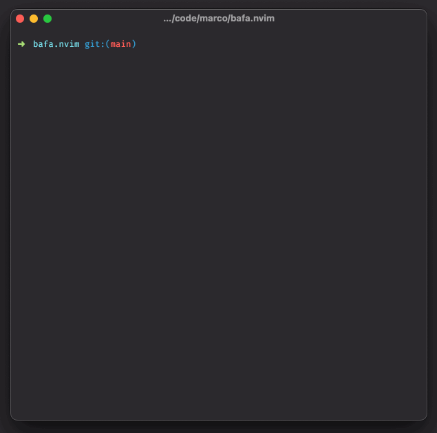

<div align="center">


# bafa.nvim


[](https://github.com/mistweaverco/bafa.nvim/releases/latest)

[Requirements](#requirements) • [Install](#install) • [Usage](#usage)

<p></p>

A minimal BufExplorer alternative for lazy people for your favorite editor.

Bafa is swahili for "buffer".

It allows you to quickly switch between buffers and delete them.

<p></p>



<p></p>

</div>

## Requirements

- [Neovim](https://github.com/neovim/neovim) (tested with 0.9.0)

## Install

Via [lazy.nvim](https://github.com/folke/lazy.nvim):

### Simple configuration

```lua
require('lazy').setup({
  -- Buffer management
  { 'mistweaverco/bafa.nvim' },
})
```
### Advanced configuration

```lua
require('lazy').setup({
  -- Buffer management
  {
    'mistweaverco/bafa.nvim',
    config = function()
      require('bafa').setup({
        width = 60,
        height = 10,
        title = "Bafa",
        title_pos = "center",
        relative = "editor",
        border = "rounded",
        style = "minimal",
        icons = {
          modified = "",
        },
      })
    end,
  },
})

```

## Usage

### `require('bafa.ui').toggle()`

Opens up a floating window with your buffers.

Press enter to select a buffer or press `dd` or `D` to delete a buffer.
