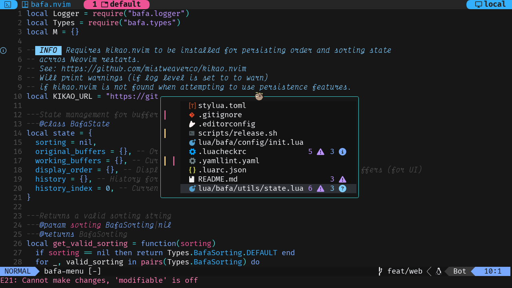

<div align="center">

![Bafa.nvim Logo][logo]

# bafa.nvim

[![Made with love][badge-made-with-love]][contributors]
[![Development status][badge-development-status]][development-status]
[![Our manifesto][badge-our-manifesto]][our-manifesto]
![Made with lua][badge-made-with-lua]
[![Latest release][badge-latest-release]][latest-release]

[What?](#what) •
[Requirements](#requirements) •
[Install](#install) •
[Usage](#usage)

<p></p>

A minimal BufExplorer alternative for lazy people for your favorite editor.

Bafa is swahili for "buffer."

It allows you to quickly switch between buffers and delete them.

<p></p>



<p></p>

</div>

## What?

Bafa.nvim is a Neovim plugin that provides a clear and efficient
way to manage and switch between buffers using a floating window interface.

It uses a notion of "commiting" changes.
This means that any modifications you make in the UI
are only applied to the actual buffer list
when you commit them.

A commit is done when you select a buffer to switch to,
or an empty spot, when no buffers are left.

Commits are discarded when you close the window
without selecting a buffer.

## Requirements

- [Neovim](https://github.com/neovim/neovim)
  (tested with 0.11.5, might work with older versions as well)

> [!TIP]
> You need to install a patched nerd-font for
> having the icons displayed correctly.
>
> You can find some patched fonts on the
> [Nerd Fonts](https://www.nerdfonts.com/) website.
>
> You should also consider installing
> [nvim-web-devicons](https://github.com/nvim-tree/nvim-web-devicons)
> for having the correct icons based on the filetye in the buffer list.

## Install

Please use release tags when installing the plugin to ensure
compatibility and stability.

The `main` branch may contain breaking changes
and isn't guaranteed to be stable.

### Lazy.nvim

See: [lazy.nvim](https://github.com/folke/lazy.nvim)

```lua
{
  'mistweaverco/bafa.nvim',
  version = 'v1.10.1',
},
```

### Packer.nvim

See: [packer.nvim](https://github.com/wbthomason/packer.nvim)

```lua
use {
  'mistweaverco/bafa.nvim',
  tag = 'v1.10.1',
})
```

### Neovim built-in package manager

```lua
vim.pack.add({
  src = 'https://github.com/mistweaverco/bafa.nvim.git',
  version = 'v1.10.1',
})
require('bafa').setup()
```


### Configuration options

```lua
---@type BafaUserConfig
return {
  -- 🔔 Notification configuration
  notify = {
    -- Used for for feedback messages
    -- Anything that has a `vim.notify` like interface will work
    -- e.g. `juu.notify`, `telescope.notify`, etc.
    -- print is also supported,
    -- even though it's does not implement the notify interface
    provider = "vim.notify",
  },
  ui = {
    -- 🪄 Rendering configuration
    render = {
      -- Custom buffer line format function, default is nil.
      -- The function receives a BafaUiBufferLine as argument
      -- and should return a string to be displayed in the UI.
      custom_format_buffer_line = nil,
    },
    -- 🧭 Buffer ordering configuration
    sort = {
      -- Buffer ordering strategy
      -- "default" | "last_used" | "manual"
      -- "default": Buffers are ordered by last usage time
      -- "last_used": Buffers are ordered by their buffer number
      -- "manual": Buffers are ordered manually by the user
      method = "default",
      -- Only applicable when `method` is "default" or "last_used"
      -- When true, instead of focusing the current buffer,
      -- the previously used buffer will be focused when opening the UI
      focus_alternate_buffer = false,
    },
    -- 🦘 Jump-labels configuration
    jump_labels = {
      -- Keys to use for jump-labels
      -- in order of preference
      -- Should be unique characters
      -- Duplicates will be ignored
      -- require('bafa.utils.keys').protected_jump_label_keys
      -- are also protected and will be ignored
      -- You can customize this to your keyboard layout
      -- will also use uppercase variants of these keys
      -- if the lower-case ones are exhausted
      -- This should give us roughly 46 unique keys (minus the protected ones)
      -- That should be enough for most use-cases
      -- but when we run out of keys, only the first buffers (in order, from top to bottom)
      -- will get jump-labels assigned
      keys = {
        "a", "s", "d", "f", "j", "k", "l", ";",
        "q", "w", "e", "r", "u", "i", "o", "p",
        "z", "x", "c", "n", "m", ",", ".",
      }
    },
    -- 🚨 Show diagnostics in the UI
    diagnostics = true,
    -- 📄 Show line numbers in the UI
    line_numbers = false,
    -- 👀 Title configuration
    title = {
      -- Title of the floating window
      text = "🦥",
      -- Position of the title: "left", "center", "right"
      -- See `:h nvim_open_win` for more details
      pos = "center",
    },
    -- 🎨 Floating window border configuration
    -- Floating window border: "single", "double", "rounded", "solid", "shadow", or a table
    -- See `:h nvim_open_win` for more details on custom borders
    border = "rounded",
    -- 🎨 Floating window style configuration
    -- Floating window style: "minimal", "normal"
    -- See `:h nvim_open_win` for more details
    style = "minimal",
    -- 📏 Floating window alignment configuration
    position = {
      -- Window position preset:
      -- "center", "top-center", "bottom-center", "top-left", "top-right",
      -- "bottom-left", "bottom-right", "center-left", "center-right"
      preset = "center",
      -- Custom row position (overrides preset if set)
      -- also supports a function that returns a number
      row = nil,
      -- Custom column position (overrides preset if set)
      -- also supports a function that returns a number
      col = nil,
    },
    -- 💄 Icons configuration
    icons = {
      -- 🚨 Diagnostics icons configuration
      diagnostics = {
        Error = "",   -- Icon for error diagnostics
        Warn = "",    -- Icon for warning diagnostics
        Info = "",    -- Icon for info diagnostics
        Hint = "",    -- Icon for hint diagnostics
      },
      -- 🖊️ Buffer changes sign configuration
      sign = {
        changes = "┃", -- Sign character for modified/deleted buffers
      },
    },
    -- 🎨 Highlight groups configuration
    hl = {
      -- 🖊️ Buffer changes sign highlight groups configuration
      sign = {
        modified = "GitSignsChange", -- Highlight group for modified buffer signs (fallback: DiffChange)
        deleted = "GitSignsDelete", -- Highlight group for deleted buffer signs (fallback: DiffDelete)
      },
    },
  },
}
```

## Usage

### `require('bafa').toggle()`

Opens up a floating window with your buffers.

The buffers are ordered by last usage time by default.

Optionally accepts a table of "instructions"
to pre-configure the UI state.

```lua
require('bafa').toggle({
    -- Show jump-labels when opening the UI
    -- defaults to false|nil
    with_jump_labels = true,
})
```

### Switching to a buffer

Press enter to select a buffer.

### Removing buffers

Press `d` to toggle "marked for deletion" on the current buffer.

Use visual mode to select multiple buffers
and then press `d` to mark them all for deletion.

> [!NOTE]
> Because of the "commit" system,
> buffers marked for deletion aren't actually deleted
> until you select buffer.
> If the selected buffer is marked for deletion as well,
> we won't delete it, but instead restore it.
>
> This also means, that you can't really wipe all buffers
> in one go, because you need to select a buffer
> to commit the deletions.
>
> To work around this, you commit any changes immediately
> with `localleader` + `w`.
> This keeps the UI open, but applies all changes.
> `localleader` + `W` commits and closes the UI.

###  Ordering buffers

Press `K` or `J` to move a buffer up or down the list.
Once you move a buffer, the new order will be kept
until you enable ordering by last usage time again (by pressing `o`).

Use visual mode to select multiple buffers
and then press `K` or `J` to move them all up or down the list.

For persistent changes between sessions, consider using
[kikao.nvim](https://github.com/mistweaverco/kikao.nvim).

### Quit without commiting changes

Press `q` or `<ESC>` to close the window,
without commiting any UI changes.

That means that no buffers will be deleted
and no buffer switch will happen.

### Undo/Redo

Press `u` to undo the last change in the UI.
Press `Ctrl+r` to redo the last undone change in the UI.


### Jump-labels

If you press `g` in normal mode,
jump-labels will be shown next to each buffer in the list.

You can then press the corresponding key
to quickly select that buffer.

Press `Escape` or `g` to exit jump-label mode without
selecting a buffer.

You can also delete buffers while in via jump-label mode
by pressing `gd` to enable jump-label delete mode.

Press `Escape` or `g` to exit jump-label delete mode.


[badge-made-with-lua]: assets/badge-made-with-lua.svg
[badge-development-status]: assets/badge-development-status.svg
[badge-our-manifesto]: assets/badge-our-manifesto.svg
[badge-made-with-love]: assets/badge-made-with-love.svg
[our-manifesto]: https://mistweaverco.com/manifesto
[development-status]: https://github.com/orgs/mistweaverco/projects/5/views/1?filterQuery=repo%3Amistweaverco%2Fbafa.nvim
[contributors]: https://github.com/mistweaverco/bafa.nvim/graphs/contributors
[logo]: assets/logo.svg
[badge-latest-release]: https://img.shields.io/github/v/release/mistweaverco/bafa.nvim?style=for-the-badge
[latest-release]: https://github.com/mistweaverco/bafa.nvim/releases/latest
